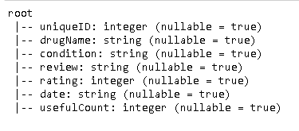
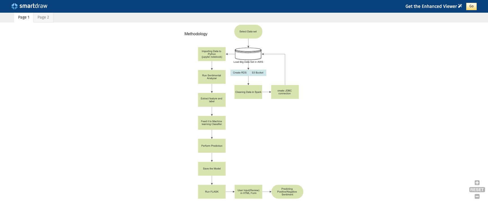
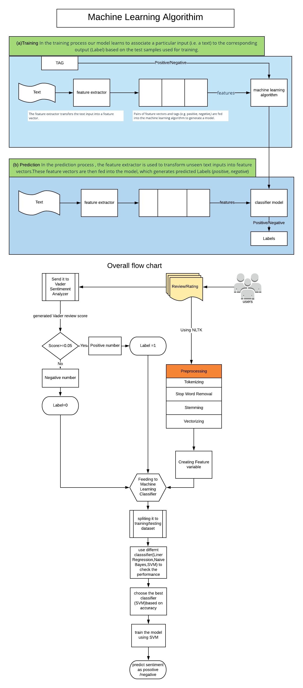
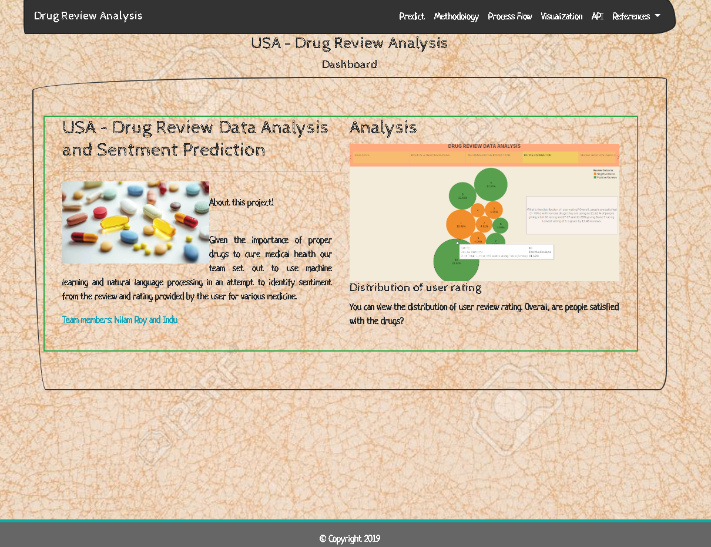
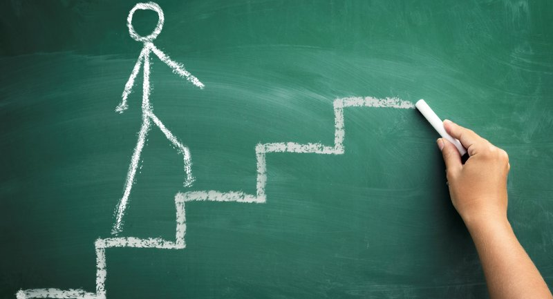

## Machine Learning and Data Analysis Project.

## Drug Review Data Analysis.

## Background

In this project, we have used the bigdata [Drug Review Dataset](https://archive.ics.uci.edu/ml/datasets/Drug+Review+Dataset+%28Drugs.com%29) from UCI Machine Learning Repository to create a web application using Flask, Python, PySpark, Tableau and various Machine Learning classification algorithms to predict the sentiment of drug reviews by patients collected over a period of 10 years ( 2008 - 2017). This dataset provides patient reviews on specific drugs along with related conditions and 10 star pateint rating reflecting overall patient satisfaction. The data was obtained by crawling online pharmaceutical review sites. The application we made, also enables anyone visiting our website to find out top medicines used for various health conditions based on the collected drug review data using visualizations and interactive charts along with many anaswers to many other questions as below....

#### Following analysis are done.

   - Can we predict the sentiment behind every drug review made?

   - Can we find the best medicine for different conditions?

   - Which are the top 10 drugs used?
   
   - Which are the top 10 conditions reported?

   - Which are the least 10 conditions reported?

   - Which are the least 10 drugs used?

   - What's the distribution of rating for this dataset?

   - Is ther any correlation between rating and usefullness?

   - Can we find any correlation between length of reviews and usefulCount.

   - Do we see any trend in the sentiment of drug reviews over the period of 10 years?

   - Do we see any trend in number of conditions reported and drugs used over the 10 years? 

  ## Tasks
  ### Extract / Transform / Load

  #### Extract
  
  After extracting the data from [UCI Machine Learning](https://archive.ics.uci.edu/ml/datasets/Drug+Review+Dataset+%28Drugs.com%29) repository in CSV format, we have stored it in AWS S3 bucket for developing machine models and creating various visualizations using Tableau.

  ### Transform

  As the data was huge with over 2M records, we used PySpark for cleaning ( removing null values and other unwanted values) using [Jupyter notebook](DrugReview/Scripts/Data_Cleaning_EDA.ipynb). We laso performed feature extraction by creating new columns for machine learning purposes and also converted date in string type to date type.

  Also created new aggregated dataframes for EDA purposes.

  **Data Schema**
   
  

    ### Load

  **AWS RDS PostgreSQL instance created**

  _[SQL Schema](DrugReview/Scripts/schema.sql)_ for schema creation.

  ### Methodology Used in the project

  

  Using the cleaned data from AWS, performed Vader Sentiment analysis on review. A training set of data was created separately from the data set. The training data was fitted and transformed using NLTK Python Machine Learning Pipeline. The resulting features were created based on TF-IDF analysis and sentiment was vectorized using Vader Sentiment analysis. All machine learning work using Pyston was done in Jupyter Notebook [here](https://github.com/ic2019/group_project3/blob/master/DrugReview/Scripts/drug_machineLearning_revised.ipynb)

  Using the newly transformed data, a Support Vector Machine classifier model is trained. This model was used to predict whether a given submission from the test set was capturing sentiment properly or not. Accuracy was determined to be ~93%.
  
  ### Overall and Machine Learning Process flow
  
  

  
  ### Home Page

  

  ### Tools Used
  
  **Data Collection**
  
  PySpark, Python, Pandas, Matplotlib, AWS, S3

  **Analysis/Visualization**

  Tableau, Plotly, Matplotlib

  **NLP/Machine Learning**

  NLTK , ScikitLearn, PySpark ML libraries

  ### Visualizations

  Link to [Tableau story](https://public.tableau.com/profile/indu.chandrasekharan#!/vizhome/drug_analysis/DrugReviewsAnalysis?publish=yes)

  
  ### Limitations

  **Below are some of the challenges and limitations we came across in our project.**
  

    - Prediction accuracy is ~93%

    -	The model is ignorant of past health condition

    -	As review is based on drug so model is biased predicting only this condition

    -	The sentiment is categorized as only positive or negative so model can’t predict neutral comments.

  ### Next Steps

   **Below are the ideas on what additional work can be done.**
   

    - Predict the best medicine based on the conditions using this dataset.

  ### Resources

  [UCI Machine Learning](https://archive.ics.uci.edu/ml/datasets/Drug+Review+Dataset+%28Drugs.com%29)

  [medium.com]https://medium.com/
 

  ### How to use this app.

  1. Clone this repo.

  2. activate your python virtual enviornement or create a new one. Install all dependencies using _pip install -r requirements.txt_

  
 